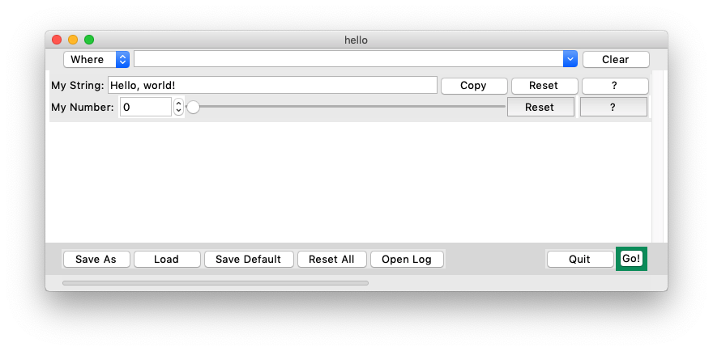
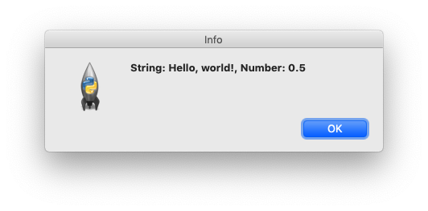

# kkAppKit

A framework for building small Python GUI applications, based on [Tkinter](https://wiki.python.org/moin/TkInter)

## Design Goals
Target app types
- Small productivity tools that focus on a single task
- Proof-of-concept prototypes, demos, and tutorials

End-User UX
- Simple layout, e.g. all-vertical, endless-page
- Supports offline and realtime control
- Supports CLI and GUI
- Supports parameter presets and per-parameter help doc

Dev UX
- Supports frontend-backend decoupling
- Ready-to-use compound widgets for solving common UI patterns
- Simple declarative configuration with code generation
- Minimum third-party dependencies

## How to work with kkappkit? (draft)
- Dev use kkappkit to initialize an app project
- Dev designs the app by writing configuration files, e.g., data model, UI bindings and events, frontend-backend communication, distribution, etc.
- Dev generates the interface (CLI/GUI) code based on the configuration
- Dev implements backend core as a CLI tool that could be an oneshot, or a realtime controller, or both
- Dev integrates backend implementation to frontend based on the configuration
- Optionally, dev builds a standalone app bundle for distribution based on the configuration

## Why not use a full-fledged framework like PySide, PyGTK?
- Most of them are too big for small tools, making CI and distribution difficult; Tkinter is the only first-party GUI lib, which simplifies distribution
- They aim for flexibility and power, which makes them hard to learn and use; I want to bake in just enough policies to cater to the RAD-style dev experience without making the framework too opinionated

## Getting started (DEPRECATED)

### Workflow

The typical workflow with kkAppKit:

- Create a project folder and a main Python script.
- Create and write up JSON configuration files: `app.json` and `default.json`. The former holds the control parameters and GUI specs the main script relies on; the latter holds the default preset of those parameters.
- In the main script, write a main function. This function also accounts for the CLI mode of your app.  
- In the main script, call a factory method among the kit's API to generate the GUI for you based on the config file. This method returns the Tkinter main top-level window, e.g., root. Launch your Tkinter main event loop from the root window.


### Hello World!
If you skim through the source code section below, you might be scared at how incredibly long it looks like. It is long for a Hello World (80 lines). There are two reasons:

- The goal of this example is to show a real picture of my day-to-day work. There is no hiding of necessary details there.
- I follow `PEP8` as much as possible, so many lines could've been merged into one, but I avoid that style here for readability.

With this very first example, we'll see a GUI that allows us to edit a text string and a number, and show them in a pop-up message box upon launching the main script under GUI mode, and prints out the same data under CLI mode.

First we create a folder called `hello_world` and a config file `app.json` under it. This is our main config file. Our app gets its control parameters from this file. Let's edit the JSON file like this.

```javascript
{
    "my_string": {
        "Title": "My String:",
        "Value": "Hello, world!",
        "Action": "Copy",
        "Help": "Our first string."
    },
    "my_number": {
        "Title": "My Number:",
        "Value": 0.5,
        "Range": [
            0.0,
            1.0
        ],
        "Steps": [
            0.01,
            0.1
        ],
        "Precision": 4,
        "Help": "Our first number."
    }
}
```
In this file we defined the titles of the parameters, their values to start with, and their help doc. For the number, we also defined:

- its value range: the `Range` field.
- its two-level control granularity: a coarse step of 0.1 used by a slider widget, and a fine step of 0.01 used by a spinbox widget.
- The precision of a decimal number: This controls how many digits we see in the spinbox as we tune the number.

Secondly, we duplicate `app.json` and rename it to `default.json`. This will contain the default values when we reset the number using one of the kit's features.

Then, we create our main script `hello.py`, which looks like this:

```python
# Import built-in modules.
import functools
from os.path import abspath, basename, dirname, splitext
from queue import Queue
import sys

# Import project modules.
from src.gui import kkgui as ui
import util

#
# Globals
#
__version__ = "0.0.1"
_basename = splitext(basename(__file__))[0]
_script_dir = abspath(dirname(__file__))
_progress_queue = Queue()


def main(argv):
    logger = util.build_logger(__file__)
    prompt = ui.Prompt(logger, is_gui=util.is_gui_mode(sys.argv))

    # Progress info and completion percentage.
    progress = (
        ('Initializing', 1),
        ('Working', 20),
        ('Done', 100)
    )

    # Make progress.
    stage = 0
    _progress_queue.put(progress[stage])

    # Help info to show under CLI mode.
    app_info = {
        'Script': __file__,
        'Task': 'Show a string and a number.',
        'Version': __version__
    }
    args = util.parse_args_config(argv, app_info)
    config = util.load_json(args.cfg_file)  # arg is a list under CLI.

    # Move the proressbar.
    stage += 1
    _progress_queue.put(progress[stage])

    # Do work.
    prompt.info('String: {}, Number: {}'.format(
        config['my_string']['Value'],
        config['my_number']['Value']))

    # Move the proressbar.
    stage += 1
    _progress_queue.put(progress[stage])
    return 0


def run_gui():
    """Run under GUI and non-verbose mode."""
    root = ui.build_script_launcher(
        title=_basename,
        app_dir=_script_dir,
        progress_queue=_progress_queue,
        handlers={
            'OnQuit': None,
            'OnSubmit': functools.partial(
                util.threaded_main,
                target=main),
            'OnCancel': None
        },
        window_size=(768, 300)
    )
    root.mainloop()


if __name__ == '__main__':
    if util.is_cli_mode(sys.argv):
        sys.exit(main(sys.argv))
    else:
        run_gui()

```

Wow! That is long! For a Hello World, what we did may seem an overkill. But wait, most of that is just necessary bootstrapping in a real-world tool and we are not shy from doing things properly; the only UI code in the example, however, is just the `run_gui()` function, which costs only two subroutines, one being a factory method. No need for explicit widget or layout coding here. All the details come from our `app.json` config file. Anybody can write up this config easily.

As said before, we include in this example the necessary features of a real-world tool according to our vision, e.g., transparency via showing progress and status, in this bare bone example. For anything larger than that, especially when it comes to realtime control via a ton of parameters, you will quickly see the benefits and the little boilerplate cost will be ignorable. But, we are not done yet.

Finally, we copy `kkgui.py` and `util.py` modules into the app folder. Now we are ready to run this app.

We'll test the GUI mode first. Run `hello.py` with shell integration of Python 3, or open a Terminal or Command Prompt and type in `python3 hello.py`. You should see the following GUI (mine runs on macOS).



From top to bottom, you see:

1. A search bar for filtering out widgets by keywords.
2. The string parameter compound widget, with Reset and Help (?) buttons. 
3. The number parameter compound widget, with Reset and Help (?) buttons. 
4. A submission panel to launch main script and handle parameter presets.
5. A status bar with a progressbar.

No. 1, 4, and 5 come for free as the kit's built-in widgets from calling the factory method `ui.build_script_launcher()`. The two core parameters show up in the order of their appearance in `app.json`.

Now drag the slider or edit the spinbox so that the number shows `0.5`, then press the bottom-right button `Go!`. You'll see the following prompt:



That concludes our GUI-mode example.

Next we'll see about the CLI mode. Open your Terminal or Command Prompt and type in:

```sh
python3 hello.py -c
```

You should see the same message as the prompt showing in the console.

`-c` tells the script to load `app.json` for all the control parameters. Running the script without switches will launch the GUI.

You'll also notice that a log file `app.log` is automatically generated under the project folder. It contains all log messages from the app, which provides complete diagnostics for the bad times.

That's it for our Hello World.

### Benefits

You can see that with kkAppKit, we can:

- consolidate the GUI and CLI mode easily.
- generate the GUI based on a config file.
- focus on writing main logic and designing data model; 
- handle default values, presets, and per-parameter help documentation.
- quickly modify the data model and doc, and reflect the changes onto the UI for free.
- keep the app transparent by showing useful diagnostics (more on this later).

### More examples

The hello-world example shows how to work out an offline control with the kkAppKit, i.e., the parameters are first saved into `app.json` before running the main script, and never changes during the run. Two more examples are included in sub-folders:

- One shows a more complex offline case: To show text on top of a picture, with the font and colour of the text configurable, using the third-party lib PIL fork [pillow](https://python-pillow.org). 
- The other is a realtime control example: Playing an oscillator tone with minimal control such as frequency and gain, using [Csound](http://www.csounds.com) as the synth backend. The GUI talks to Csound using [Open Sound Control (OSC)](http://opensoundcontrol.org). Although Csound bundles a [FLTK](https://www.fltk.org) binding to allow mixed frontend and backend code, but here I decouple the frontend completely from the backend, which allows me to quickly switch to another synth backend later.

These are specialized examples and the code is straightforward to follow. So I'll skip the details here.

## Installation

For now, simply copy `kkgui.py` and `util.py` to your app's folder.

## Configuration

kkAppKit defines a standard JSON data model for UI reflection. The format may undergo revision and new data-UI models may be added.

The format supports two types of top-level fields: 

- Controls, such as Check, Entry, Number, Options, and Path; these demand a Help field for documentation.
- Cosmetics, such as Banner, Info, and Separator; these only affects the UI's look.

The order of fields in the JSON file represents the vertical order of appearance of their generated widgets.

CAUTION: A top-level field name must be **all-lowercase ASCII** characters. This is because

- top-level fields are used as Tkinter widget names, and Tkinter supports ASCII names only. 
- Tkinter widget instance names are case-insensitive while JSON fields are case-sensitive, so we might end up with conflicting fields if we use anything other than all-lowercasing. 

### Banner

Use banner to group consecutive widgets under it. It's like a group title.

Syntax

```js
"some_name": {
        "Title": "Banner title"
}
```

### Info

Use Info to show static text such as author and version.

Syntax

```js
"some_name": {
    "Title": "some title",
    "Value": "some content",
    "Type": "Info"
}
```

### Separator

Use separator to visually separate widget rows.

Syntax

````js
"some_name": {}
````

### Check

Use Check for boolean flags.

Syntax

```js
"some_name": {
    "Title": "some title",
    "Value": false,
    "Help": "some help text."
}
```


### Entry

Use Entry for editable text string parameters. The `Copy` action below generates a button. If clicked, it copies the current string into your OS's clipboard.

Syntax

```js
"some_name": {
    "Title": "some_title",
    "Value": "some content",
    "Action": "Copy",
    "Help": "some help text."
}
```

### Path

Use Path for file and folder path input. It derives from Entry. The `Browse` action below  generates a button, giving you the basic OS file dialog support.

Syntax

```js
"some_name": {
    "Title": "some title",
    "Value": "/path/to/file.ext",
    "Type": "Path",
    "Action": "Browse ...",
    "FileTypes": [
        [
            "Format 1",
            "*.ext1"
        ],
        [
            "Format 2",
            "*.ext2"
        ]
    ],
    "Help": "some help text."
}
```


### Number

Use Number for integer and decimal numbers. It supports both value range and two-level control granularity for spinbox and slider. Decimal numbers may need a precision field, default to 4 if none is specified. 

Syntax: Integer

```js
"color_r": {
    "Title": "Color.R: ",
    "Value": 255,
    "Range": [
    	0,
    	255
	],
    "Steps": [
    	1,
        10
    ],
    "Help": "some help text."
}
```

Syntax: Decimal

```js
"some_name": {
    "Title": "some title",
    "Value": 0.0,
    "Range": [
        0.0,
        1.0
    ],
    "Steps": [
        0.01,
        0.1
    ],
    "Precision": 4,
    "Help": "some help text."
}
```

### Options

Use Options for single-choice selection. The `Value` field must be a non-negative integer, representing the 0-based index of the option menu item. The `Options` field must include strings only.

Syntax 

```js
"some_name": {
    "Title": "some title",
    "Value": 0,
    "Options": [
        "option 1",
        "option 2"
    ],
    "Help": "Font name of text to draw; actual font file to use depends on platforms."
}
```


### Private Widgets

Other than the data-model widgets for user to configure in apps, there are pre-defined widget classes for convenience. User has no access to them without coding. They are *hard-coded* and is thus not part of the JSON data-model.

### ScrollFrame

This is the *endless page*. A frame with a vertical scrollbar where generated widgets reside. Combined with SearchBar, this makes it easy to add hundreds of parameter widgets under the vertical layout.

### SearchBar

Use this to show only the widgets relevant to a user-provided keyword. It starts filtering as you type. You can also narrow down the search scope with it. Call its `.configure_internal()` method to specify the scope.

Example

```python
search_bar.configure_internal({
    'Scope': {
        'Title': 'Where',
        'MultiOptions': ['Name', 'Title', 'Help']
    }
})
```

This tells the SearchBar to look for keywords under the `Name`, `Title`, and `Help` domains. What do these domains mean? They are some properties of a compound widget and are retrieved by calling the property accessors.

You can use SearchBar to  can be adapted to search for anything you want. Right now it's used for widgets because we only use it with `ScrollFrame`, which implements the `.filter_widgets()` method as SearchBar's `OnSearch` handler.

### SubmitStrip

This compound widget handles preset save/load, and launching the main script. It's pretty simple and you can easily write up your own. But it's good enough for most offline/realtime tools. See in our examples about how to customize the submission buttons.

### ProgressStrip

This widget wraps `ttk.ProgressBar` with a label, which shows a visual progress and a text one. The hello-world example already shows you how to use a queue to push progress info from the backend thread to the GUI thread. As with `ttk.ProgressBar`, it supports the `determinate` and `indeterminate` modes.

## Compatibility

Currently the kit is only tested on macOS (High Sierra and Mojave), but there is no platform-specific code in the kit. It only supports Python 3 for future convenience.

## Implementation details

- Each compound widget supports Tkinter's geometry managers `pack` and `grid`. However, only `grid` is recommended because proper widget filtering is only possible with `grid`. `pack` makes it difficult to recall the original widget order after you revert the filtering.
- The compound widgets all have their own handlers and properties in addition to their parent Tkinter widget properties. `.configure_internal()` method is used to configure the add-on properties. Their inherited `.configure()` is used for configure basic properties. Their overriden `.bind` is used to bind additional handlers.
- A compound widget reuses the its top-level field name in the JSON config file as its name. This name registers with Tkinter.
- The widget filtering based on SearchBar relies on a `eval()` call on special property accessors defined in widgets.
- The `OnHelp` handler behind a Help(?) button can be used to retrieve help string in any form, you may also customize how to show the help, e.g., on a docked panel. By default, it gets the doc from the config file, and pops up a top-level window.
- Prompt offers `.info()`, `.warning()`, and `.error()` methods, similar to the `logging` module, however, a twist here is that it enforces writing readable diagnostics. You must provide three pieces of info: description, cause, and suggestion. If a logger is given, calling these API will both pop up a prompt, and write log messages into `app.log`.


## Acknowledgements

I must thank the author of PySimpleGUI for his thorough documentation. His insight inspired me to think about my own problems and start working on my own pragmatic UI solution instead of making a blind committment to a random framework out there.
